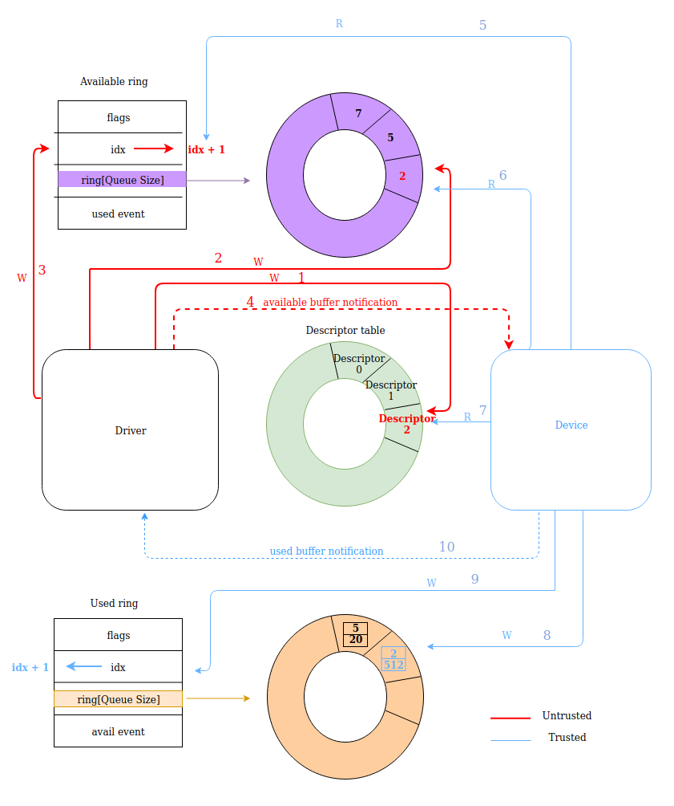
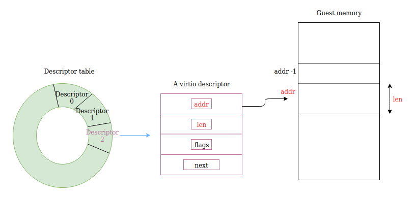

# virtio-queue

The `virtio-queue` crate provides a virtio device implementation for a virtio
queue, a virtio descriptor and a chain of such descriptors.
Two formats of virtio queues are defined in the specification: split virtqueues
and packed virtqueues. The `virtio-queue` crate offers support only for the
[split virtqueues](https://docs.oasis-open.org/virtio/virtio/v1.1/csprd01/virtio-v1.1-csprd01.html#x1-240006)
format.
The purpose of the virtio-queue API is to be consumed by virtio device
implementations (such as the block device or vsock device).
The main abstraction is the `Queue`. The crate is also defining a state object
for the queue, i.e. `QueueState`. The `Queue` objects are always created from a
state (even if it’s an empty one) in order to avoid branching in the calling
functions.

## Usage

Let’s take a concrete example of how a device would work with a queue, using
the MMIO bus.

First, it is important to mention that the mandatory parts of the virtio
interface are the following:

- the device status field → provides an indication of
  [the completed steps](https://docs.oasis-open.org/virtio/virtio/v1.1/csprd01/virtio-v1.1-csprd01.html#x1-100001)
  of the device initialization routine, 
- the feature bits →
  [the features](https://docs.oasis-open.org/virtio/virtio/v1.1/csprd01/virtio-v1.1-csprd01.html#x1-100001)
  the driver/device understand(s),
- [notifications](https://docs.oasis-open.org/virtio/virtio/v1.1/csprd01/virtio-v1.1-csprd01.html#x1-170003),
- one or more
  [virtqueues](https://docs.oasis-open.org/virtio/virtio/v1.1/csprd01/virtio-v1.1-csprd01.html#x1-230005)
  → the mechanism for data transport between the driver and device.

Each virtqueue consists of three parts:

- Descriptor Table,
- Available Ring,
- Used Ring.

Before booting the virtual machine (VM), the VMM does the following set up:

1. initialize an array of Queues based on a `max_size` and a reference to the
   memory object, by using `Queue::new(mem: M, max_size: u16)`, the queue
   objects are created from a default state.
2. register the device to the MMIO bus, so that the driver can later send
   read/write requests from/to the MMIO space, some of those requests also set
   up the queues’ state.
3. other pre-boot configurations, such as registering a fd for the interrupt
   assigned to the device, fd which will be later used by the device to inform
   the driver that it has information to communicate.

After the boot of the VM, the driver starts sending read/write requests to
configure things like:

* the supported features;
* queue parameters. The following setters are used for the queue set up:
    * `set_size` → for setting the size of the queue.
    * `set_ready` → configure the queue to the `ready for processing` state.
    * `set_desc_table_address`, `set_avail_ring_address`,
      `set_used_ring_address` → configure the guest address of the constituent
      parts of the queue.
    * `set_event_idx` → it is called as part of the features' negotiation in
      the `virtio-device` crate, and is enabling or disabling the
      VIRTIO_F_RING_EVENT_IDX feature.
* the device activation. As part of this activation, the device can also create
  a queue handler for the device, that can be later used to process the queue.

Once the queues are ready, the device can be used.

The steady state operation of a virtio device follows a model where the driver
produces descriptor chains which are consumed by the device, and both parties
need to be notified when new elements have been placed on the associate ring to
avoid busy polling. The precise notification mechanism is left up to the VMM
that incorporates the devices and queues (it usually involves things like MMIO
vm exits and interrupt injection into the guest). The queue implementation is
agnostic to the notification mechanism in use, and it exposes methods and
functionality (such as iterators) that are called from the outside in response
to a notification event.

### Data transmission using virtqueues

The basic principle of how the queues are used by the device/driver is the
following, as showed in the diagram below as well:

1. when the guest driver has a new request (buffer), it allocates free
   descriptor(s) for the buffer in the descriptor table, chaining as necessary.
2. the driver adds a new entry with the head index of the descriptor chain
   describing the request, in the available ring entries.
3. the driver increments the `idx` with the number of new entries, the diagram
   shows the simple use case of only one new entry.
4. the driver sends an available buffer notification to the device if such 
   notifications are not suppressed.
5. the device will at some point consume that request, by first reading the
   `idx` field from the available ring. This can be directly achieved with
   `Queue::avail_idx`, but we do not recommend to the consumers of the crate
   to use this because it is already called behind the scenes by the iterator
   over all available descriptor chain heads.
6. the device gets the index of the descriptor chain(s) corresponding to the
   read `idx` value.
7. the device reads the corresponding descriptor(s) from the descriptor table.
8. the device adds a new entry in the used ring by using `Queue::add_used`; the
   entry is defined in the spec as `virtq_used_elem`, and in `virtio-queue` as
   `VirtqUsedElem`. This structure is holding both the index of the descriptor
   chain and the number of bytes that were written to the memory as part of
   serving the request.
9. the device increments the `idx` from the used ring; this is done as part of
   the `Queue::add_used` that was mentioned above.
10. the device sends a used buffer notification to the driver if such
    notifications are not suppressed.

A descriptor is storing four fields, with the first two, `addr` and `len`,
pointing to the data in memory to which the descriptor refers, as shown in the
diagram below. The `flags` field is useful for indicating if, for example, the
buffer is device readable or writable, or if we have another descriptor chained
after this one (VIRTQ_DESC_F_NEXT flag set). `next` field is storing the index
of the next descriptor if VIRTQ_DESC_F_NEXT is set.

**Requirements for device implementation**

* Abstractions from virtio-queue such as `DescriptorChain` can be used to parse
  descriptors provided by the device, which represent input or output memory
  areas for device I/O. A descriptor is essentially an (address, length) pair,
  which is subsequently used by the device model operation. We do not check the
  validity of the descriptors, and instead expect any validations to happen
  when the device implementation is attempting to access the corresponding
  areas. Early checks can add non-negligible additional costs, and exclusively
  relying upon them may lead to time-of-check-to-time-of-use race conditions.
* The device should validate before reading/writing to a buffer that it is
  device-readable/device-writable.

## Design

`QueueStateT` is a trait that allows different implementations for a `Queue`
object for single-threaded context and multi-threaded context. The
implementations provided in `virtio-queue` are:

1. `QueueState` → it is used for the single-threaded context, and keeps the
   state of a virtio queue.
2. `QueueStateSync` → it is used for the multi-threaded context, and is simply
   a wrapper over an `Arc<Mutex<QueueState>>`.

`Queue` is a wrapper over a `QueueState` that also holds the guest memory
object associated with the queue.

Besides the above abstractions, the `virtio-queue` crate provides also the
following ones:

* `Descriptor` → which mostly offers accessors for the members of the
  `Descriptor`.
* `DescriptorChain` → provides accessors for the `DescriptorChain`’s members
  and an `Iterator` implementation for iterating over the `DescriptorChain`,
  there is also an abstraction for iterators over just the device readable or
  just the device writable descriptors (`DescriptorChainRwIter`).
* `AvailIter` - is a consuming iterator over all available descriptor chain
  heads in the queue.

### Notification suppression

A big part of the `virtio-queue` crate consists of the notification suppression
support. As already mentioned, the driver can send an available buffer
notification to the device when there are new entries in the available ring,
and the device can send a used buffer notification to the driver when there are
new entries in the used ring. There might be cases when sending a notification
each time these scenarios happen is not efficient, for example when the driver
is processing the used ring, it would not need to receive another used buffer
notification. The mechanism for suppressing the notifications is detailed in
the following sections from the specification:
- [Used Buffer Notification Suppression](https://docs.oasis-open.org/virtio/virtio/v1.1/csprd01/virtio-v1.1-csprd01.html#x1-400007),
- [Available Buffer Notification Suppression](https://docs.oasis-open.org/virtio/virtio/v1.1/csprd01/virtio-v1.1-csprd01.html#x1-4800010).

The `Queue` abstraction is proposing the following sequence of steps for
processing new available ring entries:

1. the device first disables the notifications to make the driver aware it is
   processing the available ring and does not want interruptions, by using
   `Queue::disable_notification`. Notifications are disabled by the device
   either if VIRTIO_F_EVENT_IDX is not negotiated, and VIRTQ_USED_F_NO_NOTIFY
   is set in the `flags` field of the used ring, or if VIRTIO_F_EVENT_IDX is
   negotiated, and `avail_event` value is not updated, i.e. it remains set to
   the latest `idx` value of the available ring that was already notified by
   the driver.
2. the device processes the new entries by using the `AvailIter` iterator.
3. the device can enable the notifications now, by using
   `Queue::enable_notification`. Notifications are enabled by the device either
   if VIRTIO_F_EVENT_IDX is not negotiated, and 0 is set in the `flags` field
   of the used ring, or if VIRTIO_F_EVENT_IDX is negotiated, and `avail_event`
   value is set to the smallest `idx` value of the available ring that was not
   already notified by the driver. This way the device makes sure that it won’t
   miss any notification.

The above steps should be done in a loop to also handle the less likely case
where the driver added new entries just before we re-enabled notifications.

On the driver side, the `Queue` provides the `needs_notification` method which
should be used each time the device adds a new entry to the used ring.
Depending on the `used_event` value and on the last used value
(`signalled_used`), `needs_notification` returns true to let the device know it
should send a notification to the guest.

## Assumptions

We assume the users of the `Queue` implementation won’t attempt to use the
queue before checking that the `ready` bit is set. This can be verified by
calling `Queue::is_valid` which, besides this, is also checking that the three
queue parts are valid memory regions.
We assume consumers will use `AvailIter::go_to_previous_position` only in
single-threaded contexts.
We assume the users will consume the entries from the available ring in the
recommended way from the documentation, i.e. device starts processing the
available ring entries, disables the notifications, processes the entries,
and then re-enables notifications.

## License

This project is licensed under either of

- [Apache License](http://www.apache.org/licenses/LICENSE-2.0), Version 2.0
- [BSD-3-Clause License](https://opensource.org/licenses/BSD-3-Clause)
