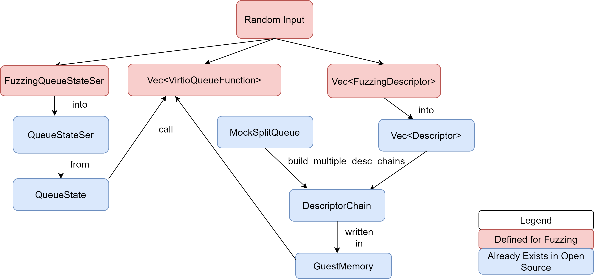

# Fuzzing

To implement fuzzing, we're first writing in the guest memory descriptor chains. This is a way to mimic what a Virtio
Driver implementation would do.

This project uses [structure-aware fuzzing](https://rust-fuzz.github.io/book/cargo-fuzz/structure-aware-fuzzing.html).
When using structure-aware fuzzing, the fuzzer can initialize a user provided structure with random data. This can be
achieved by deriving the `Arbitrary` trait on a user defined structure. One of the main components of the `virtio-queue`
implementation and a structure that we'd like to be able to initialize from random data is the `Descriptor`. As Rust
does not allow deriving foreign traits on foreign structure, we created a new structure called `FuzzingDescriptor`.
This structure contains the same fields as a regular descriptor, except that instead of using `Le64`, `Le32`, `Le16`,
it uses `u64`, `u32`, `u16`, because the former do not derive the `Arbitrary` trait, while the latter do.

## Fuzzing virtio_queue

For fuzzing the `QueueState` from the `virtio_queue` crate we defined an enum called `VirtioQueueFunction`,
which includes all the functions that we can call on the `QueueState` object. The reason why we use `QueueState` instead of `Queue`
is explained in this [issue](https://github.com/rust-vmm/vm-virtio/issues/143).

The process of fuzzing a `QueueState` object from the `virtio-queue` crate is shown in the picture below:

The fuzzer generates random input and, with this input, a Vec of `FuzzingDescriptor` and a Vec of
`VirtioQueueFunction` are initialized. The `FuzzingDescriptor`s are then transformed into regular
`Descriptor`s. A `MockSplitQueue` object is initialized. Using it and the Vector of `Descriptor`s created,
we create multiple `DescriptorChain`s (using the `build_multiple_desc_chains` defined in `mock.rs`) with which we can
initialize the `GuestMemory`. Then we use the initialized `GuestMemory` to create a `Queue` object. This `Queue` object
contains a `QueueState` object on which we call the functions generated by the fuzzer.

## Fuzzing virtio-queue-ser

While we initialized the queue presented in the previous section from a `MockSplitQueue`, we can also create a queue
starting from a state. For this purpose, we use `QueueState`, more specifically `QueueStateSer` (which is a
`QueueState` that has serialization capabilities).

The fuzzing process for `QueueState` can be seen below:

Besides a Vector of `FuzzingDescriptor`s, the fuzzer initializes a `FuzzingQueueStateSer` (identical to a `QueueStateSer`
structure) and a Vector of `VirtioQueueFunction`s.
The `GuestMemory` is initialized similarly to the process from `virtio_queue`.
We then create a `QueueStateSer` object from the `FuzzingQueueStateSer`, and using `QueueStateSer` we create a `QueueState`
object. We call the functions initialized by the fuzzer on the `QueueState` object, with the help of the `GuestMemory`.

## Fuzzing virtio_vsock

A `VsockPacket` can be created from a `DescriptorChain` or from raw pointers, and in this fuzzer we're focusing on the former.
The vsock device uses 2 queues: one for RX and one for TX, and the unit for operating with the
vsock device is a `VsockPacket`.
There are two different functions that we call on a `DescriptorChain` that can create a `VsockPacket` for the RX transmission
(by calling the `from_rx_virtq_chain` function), or a `VsockPacket` for the TX transmission (using `from_tx_virtq_chain`).

The fuzzing is done similarly to that for `virtio-queue`. The process can be seen in the picture below:

Now the `VsockPacket` can only be created from a single descriptor chain, using either `from_rx_virtq_chain`, or
`from_tx_virtq_chain`. Once the `VsockPacket` is created, we're
calling all the functions from the public interface.

## To run cargo fuzz

cargo +nightly fuzz run virtio_queue_fuzz_target.
