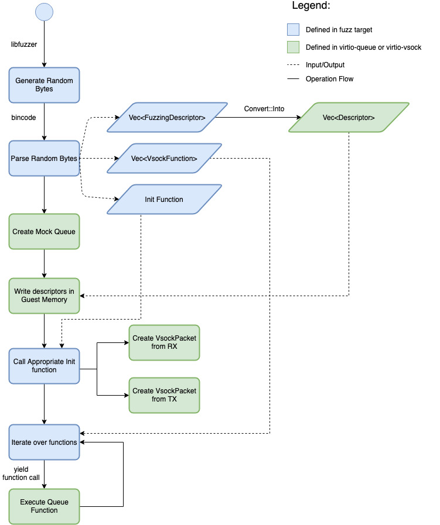

# Fuzzing

The `fuzz` crate implements fuzzing for the Virtio Devices at the library level using
[libfuzzer](https://github.com/rust-fuzz/libfuzzer). In order to mimic the typical Virtio device to
driver communication, before calling random functions with random input on the Virtio
implementations in scope, we first write random descriptors in guest memory.


## Structure Aware Fuzzing

This project uses a custom implementation for
[structure-aware fuzzing](https://rust-fuzz.github.io/book/cargo-fuzz/structure-aware-fuzzing.html).
Using the structure aware fuzzing with the [arbitrary crate](https://github.com/rust-fuzz/arbitrary)
is not possible because there is no way to generate custom input to be passed when running the fuzz
targets. This is an issue caused by the way Arbitrary generates input using a seed, and more
details are available in the [issue](https://github.com/rust-fuzz/arbitrary/issues/44) that tracks
this.

To work around this problem, and still be able to reach the goal of not manually parsing bytes,
we're using [serde]() and [bincode](). With these 2 crates, we are able to convert a
sequence of random bytes (generated by libfuzzer) to a structure that's resembles the components
from vm-virtio which we are testing.

In most cases the structures we define for fuzzing and the structures in vm-virtio have the same
memory layout and differ only by the traits they're implementing or deriving. Explicitly, the
fuzzing structures derive the serde Serialize and Deserialize traits which essentially allows us
to initialize them from random bytes.

A notable exception to this rule is the `FuzzingDescriptor` which besides deriving `Serialize` and
`Deserialize` also uses Rust primitive types as opposed to the vm-virtio defined `Descriptor` which
has as fields the little endian equivalents of the primitive types. The reason for this change is
that the little endian types do not derive the serde traits that we need.

## Fuzzing virtio_queue

For fuzzing the `Queue` implementation from the `virtio_queue` crate we defined an enum which
contains defines for all the functions that you can call on the structure. We are not limiting
these calls to functions that can be called by the driver (and would thus handle untrusted input)
because we want to simulate both driver and devices requests.

The Mock Queue is defined in the virtio-queue crate and has the purpose of mimicking a driver. As
such, we are first creating the Mock Queue, then using it to write the random descriptors generated
by the fuzzer into Guest Memory. Once this setup is done, we can create a `Queue` to be fuzzed
by using the previously parsed random functions. This process is detailed in the picture below:


## Fuzzing virtio-queue-ser

Fuzzing the virtio-queue-ser follows a similar process as the one for fuzzing the `Queue`
implementation. The target structure for fuzzing is `QueueState`, which can be used to initialize a
`Queue` structure by calling the `TryFrom` implementation from virtio-queue-ser.

As such, we initialize a Mock Queue, write the descriptor chains, and create a `QueueState` from
random data. Then, we are using the defined function from `virtio-queue-ser` to initialize the
`Queue`, up to which point the fuzz steps are the same as in the case of fuzzing the virtio-queue.
The process for is detailed below:


## Fuzzing virtio_vsock

The target for the virtio-vsock fuzzing is the `VsockPacket` structure. A `VsockPacket` can be
created either from a `DescriptorChain` or from raw pointers. For the scope of this project we are
focusing on the former.

The Vsock device uses 2 queues: one for RX and one for TX, and the unit for operating with the
vsock device is a `VsockPacket`. There are 2 different functions we can use for initializing the
`VsockPacket`: `from_rx_virtq_chain` and `from_tx_virtq_chain`.

The fuzz target implementation for `VsockPacket` is fairly similar to Virtio Queue. We are
writing random descriptor chains into guest memory, then we are initializing a packet by randomly
selecting between the 2 possible operations (from RX or TX), and lastly we are calling random
functions on the created `VsockPacket`. The process is detailed below:



## Running the Fuzzing Session

Taking as an example fuzzing for the Virtio Queue, we are working with the following modules and
directories:
- `common/src/virtio_queue.rs` -> defines the structures used for fuzzing and a set of tests that
  when ran are generating a corpus for the fuzzer.
- `corpus/virtio_queue` -> the path of the corpus used when running the fuzzing session. This is
  also the path where we are writing the files generated by running the test cases.
- `fuzz_targets/virtio_queue.rs` -> the path for the Virtio Queue fuzz target.

To be able to run fuzzing locally, we encourage you to run using the rust-vmm container which has
all the required tools already installed:

```bash
# NOTE: v16 might not be the latest version.
docker run -it --security-opt seccomp=unconfined --volume $(pwd):/workdir rustvmm/dev:v16
```

Alternatively, you can install the fuzz tools following the steps from the
[`cargo fuzz` readme](https://rust-fuzz.github.io/book/cargo-fuzz/setup.html).

### Generating Custom Fuzzing Input

To run the fuzzer with custom input, you first run the corresponding tests for each target. The
tests can be found in the local crate called `common`. Besides the tests, the `common` crate also
exports all the structures needed for running fuzzing. For simplicity, in the common crate we
define one module per fuzz target, and the modules have the same name as their corresponding fuzz
target. For example, the structures and other defines needed for fuzzing Virtio Queue are exported
as part of the `virtio_queue` Rust module (under the `common/src/virtio_queue.rs`). These defines
are used in the fuzz target definition under `fuzz_target/virtio_queue.rs`.

```bash
# The common package is not visible at the workspace level, we need to change directory.
cd fuzz/
# Run all tests in the virtio_queue module.
# This command will create the corpus/virtio_queue directory if it doesn't exist.
# And it will write one file per test case in the corpus directory.
cargo test --package common --lib virtio_queue
# Start the fuzzing session.
# The first positional argument after the run command represents the name of the fuzz target.
# The second positional argument after the run command is the path of the corpus.
cargo +nightly fuzz run --sanitizer address --jobs 12 virtio_queue corpus/virtio_queue/
```

## Running Fuzzing with Sanitizers

The available sanitizers are leak, thread, memory and address. You can only run with one sanitizer
at a time:
```bash
cargo +nightly fuzz run --sanitizer address virtio_queue
```
